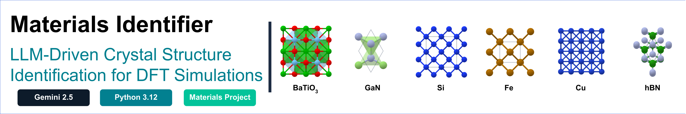

# 🔬 Material Identifier

<p align="center">
  
</p>

<p align="center">
  <a href="https://github.com/mminotaki/material-identifier" target="_blank" rel="noopener noreferrer">
    
  </a>
  <a href="https://www.python.org" target="_blank" rel="noopener noreferrer">
    
  </a>
  <a href="https://aistudio.google.com" target="_blank" rel="noopener noreferrer">
    
  </a>
  <a href="https://materialsproject.org" target="_blank" rel="noopener noreferrer">
    
  </a>
  <a href="https://opensource.org/licenses/MIT" target="_blank" rel="noopener noreferrer">
    
  </a>
</p>

---

## 📖 Overview

**Material Identifier** is a Python framework that uses Large Language Models (LLMs) to identify crystalline materials from natural-language descriptions and produce structured output files suitable as input for Density Functional Theory (DFT) calculations.

The framework accepts free-text descriptions such as:
- `"silicon in the diamond cubic structure"`
- `"a perovskite oxide with titanium and barium"`
- `"face-centred cubic copper"`
- `"wurtzite gallium nitride"`

And returns a structured JSON file containing the material's crystallographic properties.

---

## 🚀 Features

- **LLM-driven identification** — natural language to crystallographic data via Gemini 2.5 Flash
- **Dataset expansion** — generate strain, rattle, and supercell variants from a single prompt for MLIP training seed datasets
- **DFT-code agnostic output** — structured JSON compatible with VASP, Quantum ESPRESSO, CP2K
- **Materials Project validation** — cross-checks lattice parameters against experimental data
- **GW/BSE readiness** — retrieves band gap, direct/indirect nature, and metallicity
- **Automatic retry logic** — handles API rate limits 
- **Interactive CLI** — accepts custom descriptions at runtime

---

## 📂 Project Structure

```
materials-identifier/
├── identifier.py        ← main pipeline (call LLM, parse, validate, save)
├── prompts.py           ← prompt templates for Gemini
├── output_schema.py     ← MaterialStructure dataclass definition
├── validator.py         ← Materials Project cross-validation
├── expansion.py         ← strain, rattle, supercell variant generation
├── writers/             ← output writers
│   ├── __init__.py
│   └── qe.py            ← Quantum ESPRESSO pw.x input writer
├── requirements.txt
├── .env.example         ← API key template
├── .gitignore
├── docs/
│   └── LLM_Materials_Identification_Framework_Minotaki.pdf
├── notebooks/
│   └── demo.ipynb       ← interactive step-by-step walkthrough
└── examples/
    ├── silicon_diamond.json
    ├── copper_fcc.json
    ├── barium_titanate.json
    ├── gallium_nitride_wurtzite.json
    └── iron_bcc.json
```

---

## ⚙️ Installation

### 1. Clone the repository

```bash
git clone https://github.com/mminotaki/materials-identifier.git
cd materials-identifier
```

### 2. Create and activate a virtual environment

```bash
python3 -m venv mat_ident_env
source mat_ident_env/bin/activate   # Mac/Linux
mat_ident_env\Scripts\activate      # Windows
```

### 3. Install dependencies

```bash
pip install -r requirements.txt
```

### 4. Set your API keys
 
Get a free Gemini API key at https://aistudio.google.com/apikey
 
Get a free Materials Project API key at https://materialsproject.org
 
Copy `.env.example` to `.env` and fill in your keys:
 
    cp .env.example .env
 
> ⚠️ Never commit your `.env` file. It is already listed in `.gitignore`.
 
---

## 🖥️ Usage
 
**Run all built-in examples:**
 
    python3 identifier.py --run-examples
 
**Identify a custom material:**
 
    python3 identifier.py --description "rocksalt magnesium oxide"
 
**Interactive mode:**
 
    python3 identifier.py
 
**Generate Quantum ESPRESSO input:**
 
    python3 identifier.py --description "wurtzite gallium nitride" --format qe
 
The QE writer uses SSSP Efficiency pseudopotential references and applies
sensible SCF defaults (cutoffs, k-point density, smearing).
 
**Generate a variant dataset for MLIP training:**
 
    python3 identifier.py --description "silicon in the diamond cubic structure" \
        --format qe --expand strain,rattle,supercell \
        --strain iso,uni,eos \
        --n-rattle 5 \
        --supercell 2,2,2 \
        --output examples/silicon_dataset
 
| Flag | Default | Description |
|---|---|---|
| `--expand` | — | Comma-separated list: `strain`, `rattle`, `supercell` |
| `--strain` | `iso,uni,eos` | Strain modes: isotropic / uniaxial / EOS-style |
| `--n-rattle` | `5` | Number of rattled configurations |
| `--rattle-amplitude` | `0.05` | Cartesian displacement amplitude (Å) |
| `--rattle-seed` | `42` | RNG seed for reproducibility |
| `--supercell` | `2,2,2` | Supercell scaling as `na,nb,nc` |
 
**Import in your own code:**
 
    from identifier import identify_material
 
    material, validation = identify_material(
        "rocksalt magnesium oxide",
        output_path="examples/mgo.json"
    )
    print(material.to_json())
 
---


## 📄 Output Format
 
Each run produces a structured JSON file:
 
    {
      "formula": "GaN",
      "name": "Gallium Nitride",
      "crystal_system": "hexagonal",
      "space_group_symbol": "P6_3mc",
      "space_group_number": 186,
      "point_group": "6mm",
      "a": 3.189, "b": 3.189, "c": 5.185,
      "alpha": 90.0, "beta": 90.0, "gamma": 120.0,
      "atomic_positions": [
        {"element": "Ga", "x": 0.3333, "y": 0.6667, "z": 0.0, "wyckoff_position": "2b"},
        {"element": "N",  "x": 0.3333, "y": 0.6667, "z": 0.375, "wyckoff_position": "2b"}
      ],
      "source": "LLM-inferred",
      "confidence": "high",
      "notes": null,
      "validation": {
        "status": "validated",
        "mp_id": "mp-804",
        "parameter_comparison": {
          "a": {"gemini": 3.189, "mp": 3.189, "diff": 0.0},
          "c": {"gemini": 5.185, "mp": 5.192, "diff": 0.007}
        }
      },
      "electronic_properties": {
        "band_gap_ev": 1.73,
        "is_gap_direct": true,
        "is_metal": false,
        "gw_recommended": true,
        "bse_recommended": true,
        "note": "Semiconductor/insulator — GW/BSE applicable"
      }
    }
 


---

## 📊 Example Runs

| Description | Formula | Space Group | Validation | GW/BSE |
|---|---|---|---|---|
| "silicon in the diamond cubic structure" | Si | Fd-3m #227 | mismatch (conventional vs primitive cell) | ✅ |
| "face-centred cubic copper" | Cu | Fm-3m #225 | mismatch (conventional vs primitive cell) | ❌ metal |
| "a perovskite oxide with titanium and barium" | BaTiO3 | P4mm #99 | ✅ validated | ✅ |
| "wurtzite gallium nitride" | GaN | P6_3mc #186 | ✅ validated | ✅ |
| "iron in the body-centred cubic structure" | Fe | Im-3m #229 | mismatch (magnetic phase) | ❌ metal |

Full output files are available in the `examples/` folder.

---
---

## 🌱 Seeding MLIP Training Datasets

This framework was built to identify a single material from a description, but the same machinery can populate starting structures for high-throughput DFT workflows. Machine-learned interatomic potentials (MLIPs) such as MACE, NequIP, or Allegro require diverse DFT training data — different lattice strains, perturbed atomic positions, and larger cells. Assembling these starting structures by hand is a slow step. The `expansion.py` module turns a single identified structure into a folder of variants ready for DFT:

- **Strain variants** — isotropic, uniaxial, and dense EOS-style grids for sampling volumetric and anisotropic mechanical response (bulk modulus, elastic constants, equation of state).
- **Rattled variants** — random Cartesian displacements applied to each atom in real space (not fractional), giving consistent perturbation magnitudes across materials. Seeded for reproducibility.
- **Supercells** — exact integer expansion of the unit cell. Foundation for any future defect or surface work.


## 🔭 Scope and Limitations

**Supported materials:**
- Elemental metals and semiconductors (Si, Cu, Fe, Al, Au...)
- Binary compounds (GaN, GaAs, NaCl, MgO...)
- Ternary oxides and perovskites (BaTiO3, SrTiO3...)
- Common structure types: FCC, BCC, diamond cubic, wurtzite, rocksalt, perovskite

**Not supported:**
- Highly complex or recently synthesised materials with limited literature coverage
- Disordered, amorphous, or partially ordered materials
- Materials requiring precise experimental lattice parameters

**Known limitations:**
- Lattice parameter mismatches may reflect conventional vs primitive cell differences rather than errors
- Input validation uses the same LLM and may occasionally pass non-material descriptions
- Free tier API is limited to 20 requests/day


---

## 📦 Dependencies

| Package | Purpose |
|---|---|
| `google-genai` | Gemini API client |
| `python-dotenv` | Loads API keys from `.env` file |
| `mp-api` | Materials Project database client |
| `pymatgen` | Crystal structure objects and analysis |

---

## Presentation
A slide deck summarizing the framework design and results is available
in [`docs/presentation.pdf`](docs/LLM_Materials_Identification_Framework_Minotaki.pdf)

## ⚖️ License

This project is licensed under the MIT License — see the [LICENSE](LICENSE) file for details.